## **1️⃣ Funcionalidades Principais**  

### **💬 Comunicação**  
✔ **Chat Global** – Todos os alunos e professores podem interagir.  
✔ **Chat por Turma** – Apenas membros de uma turma podem enviar mensagens.  
✔ **Chat por Sala** – Conversa específica dentro de uma sala de aula.  
✔ **Mensagens Privadas** – Alunos e professores podem trocar mensagens diretas.  
✔ **Notificações em Tempo Real** – Atualizações sobre mensagens, eventos e tarefas.  
✔ **Chamadas de Áudio/Vídeo** – Aulas ao vivo com controle de participantes.  

### **🏫 Organização Escolar**  
✔ **Gerenciamento de Usuários** – Professores, alunos, administradores e supervisores.  
✔ **Turmas e Salas** – Estrutura organizacional clara com permissões específicas.  
✔ **Calendário e Eventos** – Provas, trabalhos e reuniões escolares.  
✔ **Sistema de Permissões** – Alunos podem ver apenas conteúdos autorizados.  

### **🎮 Gamificação**  
✔ **Ranking de Alunos** – Baseado na participação e desempenho acadêmico.  
✔ **Ranking de Turmas** – Motivação coletiva para engajamento.  
✔ **Missões e Conquistas** – Alunos podem desbloquear badges ao cumprir tarefas.  
✔ **Sistema de Pontos** – Pontos por interação, resolução de dúvidas, entregas e mais.  

### **📚 Recursos Educacionais**  
✔ **Biblioteca de Materiais** – Professores podem disponibilizar PDFs, vídeos, quizzes.  
✔ **Quizzes e Exercícios** – Avaliação contínua dos alunos.  
✔ **Entrega de Trabalhos** – Upload e feedback de atividades escolares.  

---

## **2️⃣ Arquitetura do Sistema**  

A plataforma será baseada em **microservices**, garantindo **alta escalabilidade e flexibilidade**.  

### **📌 Frontend (Cliente)**
- Aplicação em **React** ou **Angular** (SPA).  
- Comunicação via **GraphQL/REST** com o backend.  
- WebSockets para mensagens **em tempo real**.  
- **PWA** para experiência fluida no mobile.  

### **📌 Backend (Microservices)**
- **Gateway API (Spring Cloud Gateway)** – Controla o tráfego e roteia chamadas.  
- **Autenticação e Autorização (Spring Security + OAuth2/JWT)** – Segurança e controle de acesso.  
- **Serviço de Usuários** – CRUD de alunos, professores e admins.  
- **Serviço de Comunicação (WebSockets + Kafka)** – Mensagens, notificações e chamadas.  
- **Serviço de Vídeo/Áudio (WebRTC + Media Server)** – Streaming para aulas ao vivo.  
- **Serviço de Gamificação** – Lida com pontos, rankings e conquistas.  
- **Serviço de Materiais** – Upload e distribuição de arquivos e recursos educativos.  
- **Serviço de Calendário e Eventos** – Gerenciamento de horários e atividades.  
- **Serviço de Notificações (Kafka + Firebase)** – Push notifications e alertas em tempo real.  

### **📌 Banco de Dados e Armazenamento**
- **PostgreSQL/MySQL** – Dados estruturados (usuários, turmas, eventos).  
- **MongoDB/Cassandra** – Dados não estruturados (chats, logs, gamificação).  
- **Redis** – Cache de alto desempenho para otimizar resposta de consultas frequentes.  
- **MinIO/S3** – Armazenamento de arquivos e vídeos.  

### **📌 Infraestrutura e Escalabilidade**
- **Docker + Kubernetes** – Para orquestração dos microservices.  
- **Kafka/RabbitMQ** – Mensageria assíncrona para eventos do sistema.  
- **Prometheus + Grafana** – Monitoramento da infraestrutura e métricas.  
- **ElasticSearch** – Busca rápida para mensagens, usuários e conteúdos.  

---

## **3️⃣ Fluxo de Funcionamento**  

### **📌 Exemplo: Aula ao Vivo (Vídeo + Chat)**  
1️⃣ O professor inicia uma aula ao vivo (WebRTC).  
2️⃣ Os alunos entram na sala e são autenticados via JWT.  
3️⃣ WebSockets gerenciam **chat em tempo real**.  
4️⃣ O **Media Server** distribui o vídeo para os alunos.  
5️⃣ Mensagens e eventos passam por Kafka para garantir escalabilidade.  
6️⃣ Logs da aula são armazenados para revisão posterior.  

---

## **4️⃣ Escalabilidade e Performance**
💡 **Microservices desacoplados** evitam gargalos.  
💡 **CDN para cache** de arquivos estáticos e vídeos.  
💡 **Banco de dados otimizado** com sharding e replicação.  
💡 **Infraestrutura escalável** com Kubernetes e auto-scaling.  

---

## **5️⃣ Diferenciais e Melhorias**
🔹 **AI Tutor** – Recomenda conteúdos para alunos com base em dificuldades.  
🔹 **Moderação Automática** – Filtra mensagens inapropriadas no chat.  
🔹 **Análise de Engajamento** – Relatórios de participação para professores.  
🔹 **Plataforma Aberta para APIs** – Para futuras integrações com sistemas escolares.  

---

## Diagrama Inicial

```mermaid
erDiagram
    USER {
        UUID id
        STRING name
        STRING email
        STRING password
        STRING role  "Enum: STUDENT, TEACHER, ADMIN"
    }
    
    CLASSROOM {
        UUID id
        STRING name
        UUID teacher_id
    }
    
    CHAT {
        UUID id
        STRING type  "Enum: PRIVATE, CLASSROOM, GENERAL"
    }
    
    MESSAGE {
        UUID id
        UUID chat_id
        UUID sender_id
        TEXT content
        TIMESTAMP sent_at
    }
    
    VIDEO_CALL {
        UUID id
        UUID classroom_id
        UUID host_id
        TIMESTAMP start_time
        TIMESTAMP end_time
    }
    
    TASK {
        UUID id
        UUID classroom_id
        STRING title
        TEXT description
        TIMESTAMP deadline
    }
    
    RANKING {
        UUID id
        UUID user_id
        INT points
    }
    
    MATERIAL {
        UUID id
        UUID classroom_id
        STRING title
        STRING file_url
    }
    
    USER ||--o{ CLASSROOM : "participa"
    USER ||--o{ CHAT : "envia mensagens"
    CLASSROOM ||--o{ CHAT : "possui"
    CHAT ||--o{ MESSAGE : "contém"
    USER ||--o{ MESSAGE : "envia"
    CLASSROOM ||--o{ VIDEO_CALL : "realiza"
    USER ||--o{ VIDEO_CALL : "participa"
    CLASSROOM ||--o{ TASK : "tem"
    USER ||--o{ RANKING : "possui"
    CLASSROOM ||--o{ MATERIAL : "disponibiliza"
```

## System design monito

```mermaid
graph LR
    subgraph Clientes
        User["📱 Usuário (Aluno/Professor/Admin)"]
        Browser["🖥️ Navegador Web"]
        MobileApp["📱 App Mobile"]
    end

    subgraph Frontend
        WebApp["🌐 Aplicação Angular/React"]
    end

    subgraph Backend
        API["⚙️ API Spring Boot"]
        AuthService["🔑 Serviço de Autenticação (JWT)"]
        ChatService["💬 Serviço de Chat (WebSocket)"]
        VideoService["🎥 Serviço de Videochamada (WebRTC)"]
        TaskService["📚 Serviço de Tarefas"]
        RankingService["🏆 Serviço de Gamificação"]
    end

    subgraph Banco de Dados
        DBMain["🗄️ PostgreSQL (Users, Tasks, Messages)"]
        DBRedis["⚡ Redis (Cache de mensagens e ranking)"]
    end

    subgraph Infraestrutura
        LoadBalancer["⚖️ Load Balancer"]
        Gateway["🚪 API Gateway"]
        Storage["🗄️ AWS S3 (Arquivos e vídeos)"]
    end

    User -->|HTTP| Browser
    User -->|API REST| MobileApp

    Browser -->|API REST| Gateway
    MobileApp -->|API REST| Gateway

    Gateway -->|Balanceamento| LoadBalancer
    LoadBalancer -->|Escala Horizontal| API

    API --> AuthService
    API --> ChatService
    API --> VideoService
    API --> TaskService
    API --> RankingService
    API -->|SQL Queries| DBMain
    API -->|Cache| DBRedis

    VideoService --> Storage
    ChatService --> DBRedis

    RankingService --> DBRedis
    TaskService --> DBMain

    Storage -->|Acesso a arquivos| API
```

## System design microservice

```mermaid
graph LR
    subgraph Clientes
        User["📱 Usuário (Aluno/Professor/Admin)"]
        Browser["🖥️ Navegador Web"]
        MobileApp["📱 App Mobile"]
    end

    subgraph API Gateway
        Gateway["🚪 API Gateway (Spring Cloud Gateway)"]
    end

    subgraph Load Balancer
        LoadBalancer["⚖️ Load Balancer"]
    end

    subgraph Microservices
        AuthService["🔑 Autenticação (JWT, OAuth)"]
        UserService["👤 Gerenciamento de Usuários"]
        ClassService["🏫 Turmas e Salas"]
        ChatService["💬 Chat (WebSocket)"]
        VideoService["🎥 Videochamada (WebRTC)"]
        TaskService["📚 Tarefas e Provas"]
        RankingService["🏆 Gamificação e Ranking"]
        NotificationService["📢 Notificações (E-mail, Push)"]
    end

    subgraph Banco de Dados
        DBMain["🗄️ PostgreSQL (Users, Tasks, Chats)"]
        DBRedis["⚡ Redis (Cache e Ranking)"]
    end

    subgraph Mensageria
        Kafka["📩 Apache Kafka / RabbitMQ"]
    end

    subgraph Storage
        S3["🗄️ AWS S3 (Arquivos e vídeos)"]
    end

    subgraph Infraestrutura
        Kubernetes["☸️ Kubernetes (Orquestração)"]
        Docker["🐳 Docker Containers"]
    end

    User -->|REST API| Browser
    User -->|REST API| MobileApp

    Browser -->|REST API| Gateway
    MobileApp -->|REST API| Gateway

    Gateway -->|Balanceamento| LoadBalancer
    LoadBalancer -->|Roteamento| AuthService
    LoadBalancer -->|Roteamento| UserService
    LoadBalancer -->|Roteamento| ClassService
    LoadBalancer -->|Roteamento| ChatService
    LoadBalancer -->|Roteamento| VideoService
    LoadBalancer -->|Roteamento| TaskService
    LoadBalancer -->|Roteamento| RankingService
    LoadBalancer -->|Roteamento| NotificationService

    AuthService --> DBMain
    UserService --> DBMain
    ClassService --> DBMain
    TaskService --> DBMain
    RankingService --> DBRedis

    ChatService --> DBRedis
    ChatService --> Kafka
    VideoService --> S3

    NotificationService --> Kafka
    NotificationService --> DBMain

    Kafka --> NotificationService
    Kafka --> ChatService
    Kafka --> TaskService

    Kubernetes --> Docker
    Docker --> AuthService
    Docker --> UserService
    Docker --> ClassService
    Docker --> ChatService
    Docker --> VideoService
    Docker --> TaskService
    Docker --> RankingService
    Docker --> NotificationService
```

